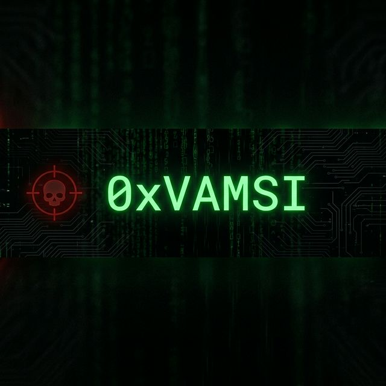

<div align="center">



[](https://git.io/typing-svg)

<br/>

<a href="https://cve.mitre.org/cgi-bin/cvename.cgi?name=CVE-2026-35454"></a>
<a href="https://bugcrowd.com/"></a>
<a href="#"></a>

</div>

<br/>

<table>
<tr>
<td width="50%" valign="top">

### 🔒 `About`

```yaml
Name:      Kandlaguduru Vamsi
Handle:    0xVAMSI
Role:      Offensive Security Researcher
Education: B.E. CS (Cybersecurity) — PES University
Focus:     Web Apps · Cloud · Red Team Ops
```

Disclosed **CVE-2026-35454**. Recognized on **Bugcrowd Hall of Fame**. Built cloud security automation at **Gauntlet** with **93.75% detection accuracy**. Currently consulting AI companies on application security.

</td>
<td width="50%" valign="top">

### ⚔️ `Arsenal`


</td>
</tr>
</table>

---

<div align="center">

### 🛡️ `Certifications`


</div>

---

<div align="center">

### 📊 `Stats`


<br/>


</div>

---

<div align="center">

### 📬 `Contact`

[](mailto:sree.vamsik2005@gmail.com)
[](https://linkedin.com/in/vamsi-k-5419632a9)
[](https://github.com/vamsik2k5)

<br/>


</div>
